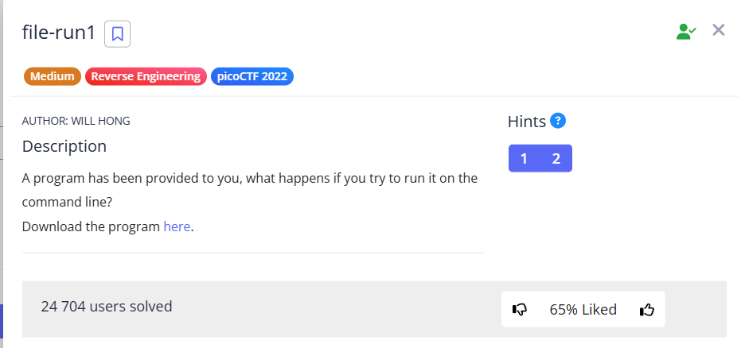

Similar to the previous task [file-run1](file-run1.md), we need to download and execute the file, but this time with the parameter

---

Download and grant rights to execute:


```bash
wget https://artifacts.picoctf.net/c/156/run
chmod +x run
```


I tried [decompile](https://dogbolt.org/?id=15c2c500-4e35-48d2-9c64-df72f1a8673b) this file and my eye caught the following function:  


```c
if ((param_1 < 2) || (2 < param_1))
```
This condition is true if `param_1` (i.e., `argc`) is not equal to 2. This means that the program expects to be run with **exactly one additional argument**, besides the name of the program itself.


* If run `./program_name`, then `argc `= 1.
* IF `./program_name arg1`, then `argc `= 2.
* If `./program_name arg1 arg2`, then `argc `= 3.
* Therefore, branch `else (argc == 2)` will be executed when we run the program with **one argument**.

Identically to the previous task, we display the flag:

```shell
./run Hello! | cut -d " " -f4
```


`picoCTF{F1r57_4rgum3n7_96f2195f}`
