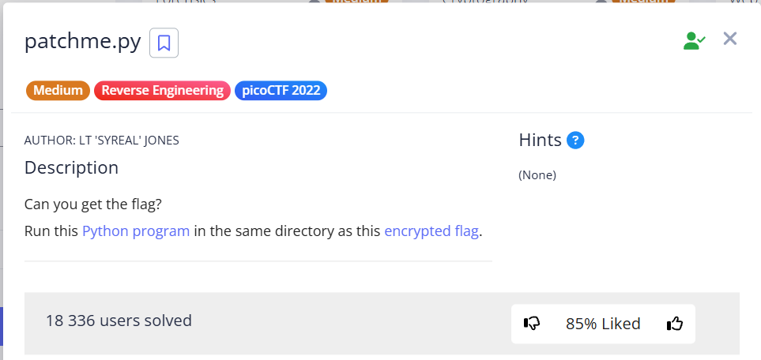
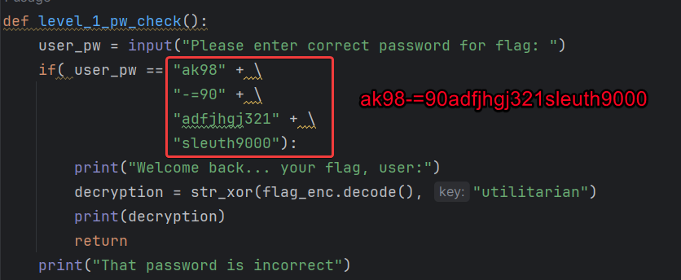
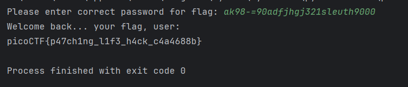

In this task, we have a Python script and a file that is decrypted by this script: <br/>


`patchme.flag.py`:<br/>
```python
### THIS FUNCTION WILL NOT HELP YOU FIND THE FLAG --LT ########################
def str_xor(secret, key):
    #extend key to secret length
    new_key = key
    i = 0
    while len(new_key) < len(secret):
        new_key = new_key + key[i]
        i = (i + 1) % len(key)        
    return "".join([chr(ord(secret_c) ^ ord(new_key_c)) for (secret_c,new_key_c) in zip(secret,new_key)])
###############################################################################


flag_enc = open('flag.txt.enc', 'rb').read()


def level_1_pw_check():
    user_pw = input("Please enter correct password for flag: ")
    if( user_pw == "ak98" + \
                   "-=90" + \
                   "adfjhgj321" + \
                   "sleuth9000"):
        print("Welcome back... your flag, user:")
        decryption = str_xor(flag_enc.decode(), "utilitarian")
        print(decryption)
        return
    print("That password is incorrect")


level_1_pw_check()
```
<br/>
We need to concatenate the pieces of the "secret" key to decrypt the flag: <br/><br/>

<br/><br/>

<br/>

`picoCTF{p47ch1ng_l1f3_h4ck_c4a4688b}`
