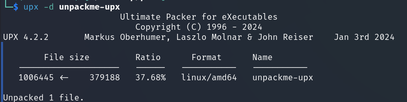

In this task, we are prompted to unpack the file `unpackme-upx`. 

---

As you see from the name and hint, the UPX packer was used. First, let's check if UPX was really used:  

  

This can also be seen by applying the `strings` command to the file and viewing the readable strings:

    

We can see to what filesize UPX has compressed the file. To "uncompress" it:

    
 
Let's use `ghidra` for decompilation:

```bash
sudo apt install ghidra
```

> [!TIP]
> How to create a project and import a file for decompilation shown in this [video](https://youtu.be/3Ikn8Y775Lk?si=Q16yBvc9Gy_5LyEs)    

    

Find the same `if` that is executed when you run the program, after first running `chmod +x unpackme_upx`.   

Let's convert hex to dec:  

    


`picoCTF{up><_m3_f7w_5769b54e}`
