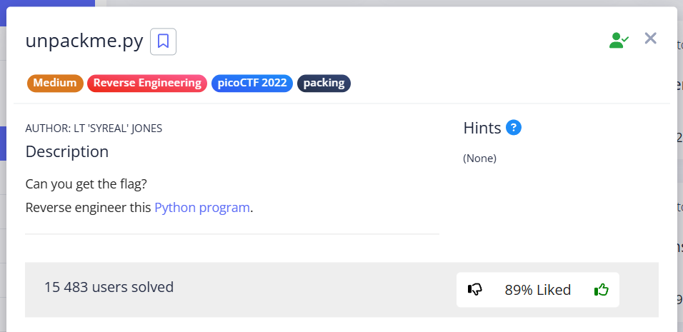

Let's analyze the code of the downloaded program:  


I decided to rewrite this program with a step-by-step output of everything that happens here  
`goofy_stuff.py`:          

```python
import base64
from cryptography.fernet import Fernet
#global
payload = b'gAAAAABkzWGWvEp8gLI9AcIn5o-ahDUwkTvM6EwF7YYMZlE-_Gf9rcNYjxIgX4b0ltY6bcxKarib2ds6POclRwCwhsRb1LOXVt4Q3ePtMY4BmHFFZlIHLk05CjwigT7hiI9p3sH9e7Cpk1uO90xbHbuy-mfi3nkmn411aBgwxyWpJvykpkuBIG_nty6zbox3UhbB85TOis0TgM0zG4ht0-GUW4wTq2_5-wkw3kV1ZAisLJHzF-Z9oLMmwFZU0UCAcHaBTGDF5BnVLmUeCGTgzVLSNn6BmB61Yg=='

key_str = 'correctstaplecorrectstaplecorrec'

key_str_encoded = key_str.encode()
print(f'key_str_encoded: {key_str_encoded}')

key_base64 = base64.b64encode(key_str_encoded)
print(f'key_base64: {key_base64}')

f = Fernet(key_base64)
print(f'f: {f}')

plain = f.decrypt(payload)
print(f"plain (Fernet Decrypted payload): {plain}")
```

<br/>


The output of the last `print` looks as if the program code was encrypted using the Fernet algorithm, and it was necessary to figure out how the key is formed (this algorithm is symmetric).<br/><br/>

As can be seen from the program, this payload is **program code encrypted** with the Fernet algorithm using a **key** that was previously **string encoded + b64encoded**.

I check my guess in CyberChef.

The key I got: `Y29ycmVjdHN0YXBsZWNvcnJlY3RzdGFwbGVjb3JyZWM=`

Payload is ciphertext

  

`picoCTF{175_chr157m45_85f5d0ac}`
 
