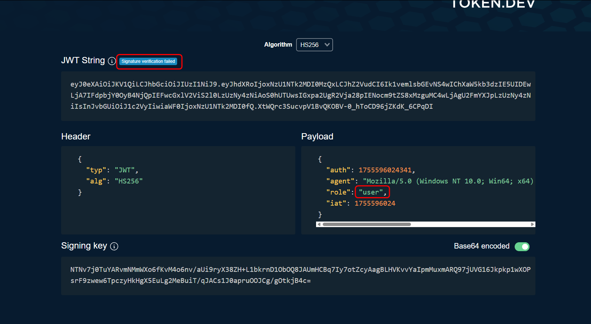

Let's log in with the provided credentials and examine the cookie. It is a JWT.


To analyze its headers, I'll use the tool [JWT Debugger](https://token.dev):





In order for JWT to pass for the task, we need to modify it. 

> [!NOTE]
> The JWT structure consists of three components:
> 
> * header
> * payload 
> * signature (secret key required)
> 
> They are all separated by 2 dividers. `.`
> 
> [Source](https://www.geeksforgeeks.org/web-tech/json-web-token-jwt/)


```
HMACSHA256(
    base64UrlEncode(header) + "." + base64UrlEncode(payload),
    secret
)
```


Let's change `user` to `admin` :


A secret key is required for the signature, which is not mentioned in the condition, so we will choose that the encryption algorithm is not applied (`none`).

> [!IMPORTANT]
> JWT always consists of 3 parts with 2 characters `.` , so even though there is no signature, we must add `.` at the end.

Now insert this token into the `cookie` field and refresh the page:


`picoCTF{succ3ss_@u7h3nt1c@710n_3444eacf}`
