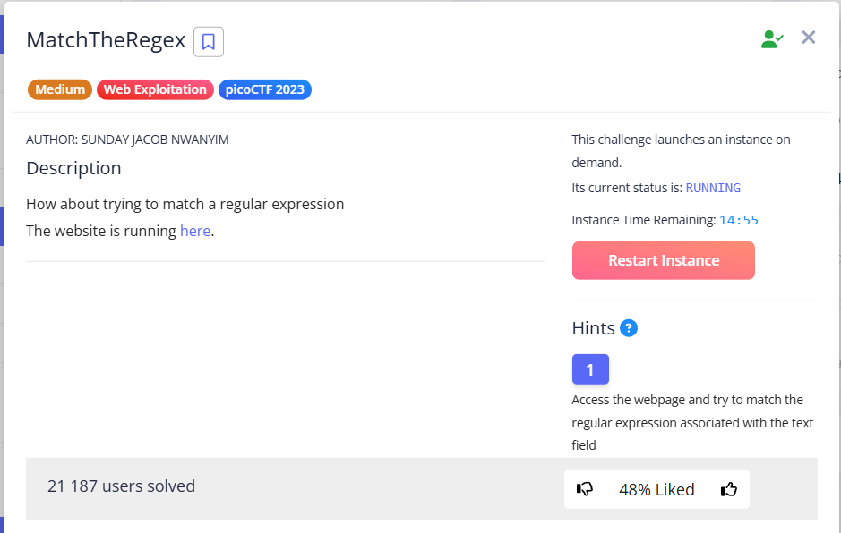
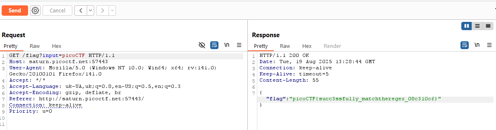
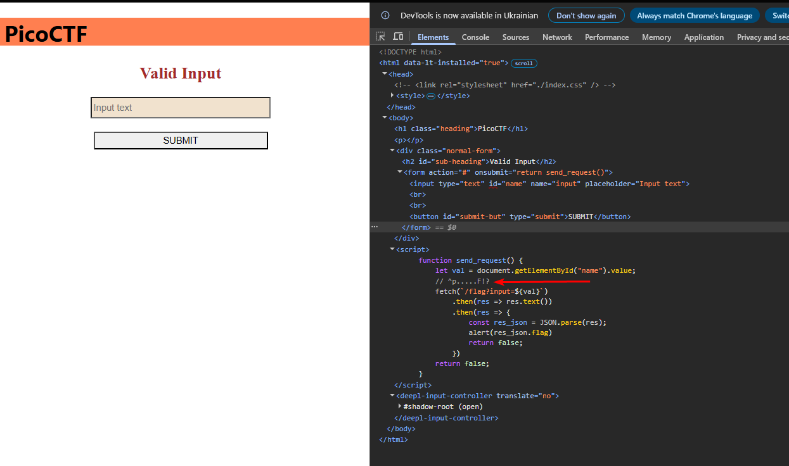

This task has an input form with one field. I entered arbitrary text and intercepted the request via `Burp` + `FoxyProxy`.


Send it to `Repeater` for further investigation.


```http
GET /flag?input=thisistext
```


I substituted various combinations into the URL to understand how the regular expression filters the input:


```
aaaa
flag
123123
123aaa
aaa123
```


And then I just thought, why not try `picoCTF`... And all of a sudden I was right:




I also thought about searching for a regular expression in the backend and found a hint in the Source Code:





`picoCTF{succ3ssfully_matchtheregex_08c310c6}`
