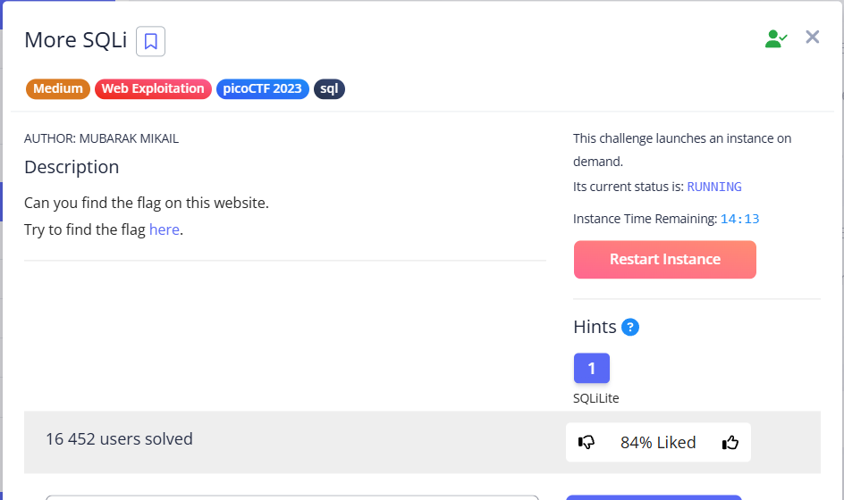
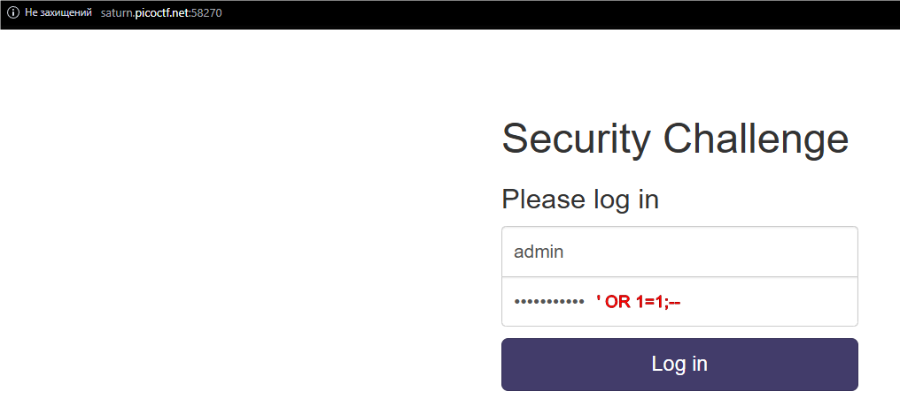
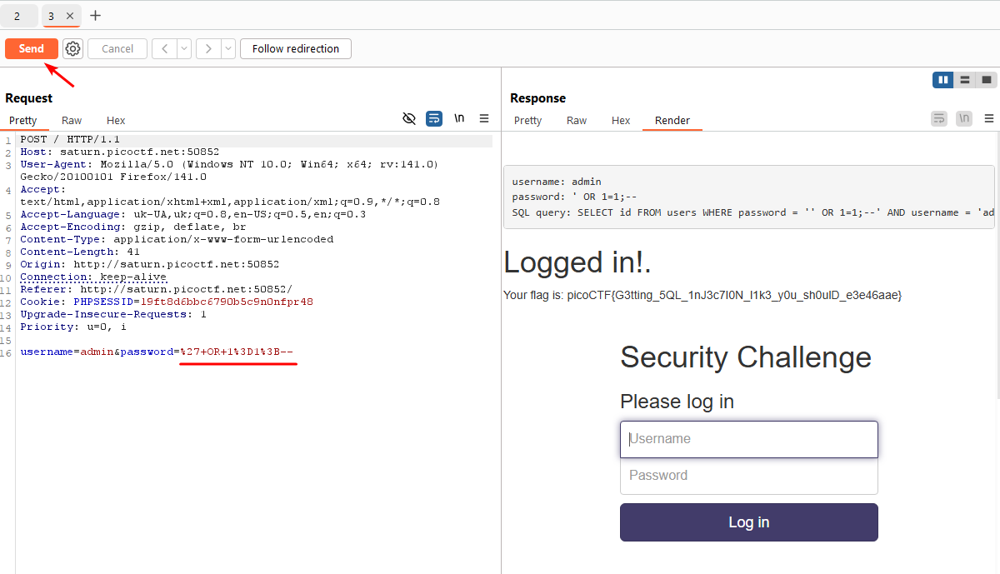

This task has common features with [SQLiLite](SQLiLite.md) and [findme](findme.md). Here we also need to use classic SQL injection + `BurpSuite`.

---

The SQL query used is almost identical to [SQLiLite](SQLiLite.md), but rearranged:  


```sql
SELECT id FROM users WHERE password = 'PASSWORD' AND username = 'USERNAME'
```


We will use a standard injection that will meet three requirements:

* close `password` field: `password=' '`
* add a condition that will always return `true`
* truncate the rest of the query   


The following payload falls under these requirements `' OR 1=1;--` 

> [!TIP]
> More SQLi payloads and explanation in my note: [*click*](../../notes/Understanding%20SQL%20Injections.md)




Intercept this request via `FoxyProxy + Burp` and immediately forward it to `Repeater`:





In `Repeater` I simply pressed `Send` and it was enough for solution.

`picoCTF{G3tting_5QL_1nJ3c7I0N_l1k3_y0u_sh0ulD_e3e46aae}`
