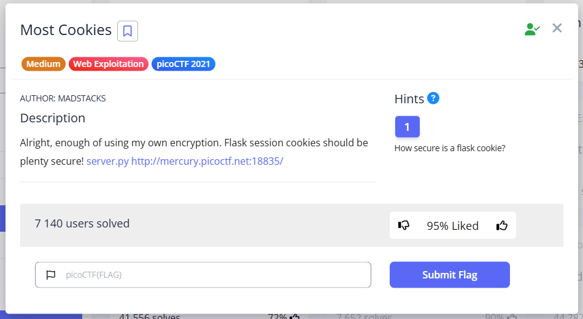  

The task is to select the correct key from the `cookie_names` array for signing the flask cookie token. 
In addition, the json data that is serialized and included in the cookie token, which will give us the flag, must be `{"very_auth":"admin"}` (Admin Cookie), but the word `admin` is not in the `cookie_names` array.  

--- 

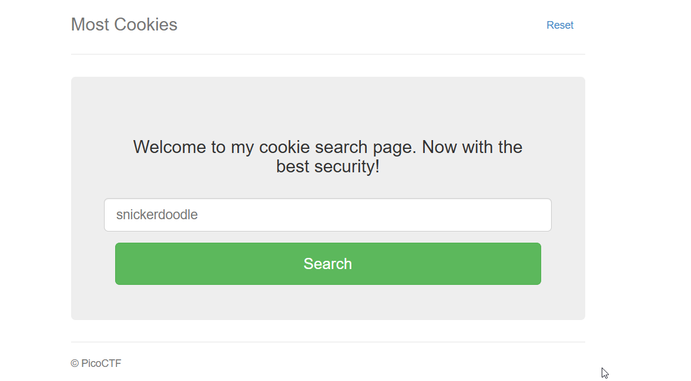  

First, we see an input form that only accepts words specified in the `cookie_names` array. Let's write a program to make the array look more convenient:  

```python
cookie_names = ["snickerdoodle", "chocolate chip", "oatmeal raisin", "gingersnap", "shortbread", "peanut butter", "whoopie pie", "sugar", "molasses", "kiss", "biscotti", "butter", "spritz", "snowball", "drop", "thumbprint", "pinwheel", "wafer", "macaroon", "fortune", "crinkle", "icebox", "gingerbread", "tassie", "lebkuchen", "macaron", "black and white", "white chocolate macadamia"]

print(len(cookie_names))
print(cookie_names[18])

for cookie in cookie_names:
    # this if is just so that the cookie names are in one line
    if cookie_names.index(cookie) < 10:
        print(f" {cookie_names.index(cookie)} : {cookie}")
    else:
        print(f"{cookie_names.index(cookie)} : {cookie}")
```

The array itself with indexes: 

```
 0 : snickerdoodle
 1 : chocolate chip
 2 : oatmeal raisin
 3 : gingersnap
 4 : shortbread
 5 : peanut butter
 6 : whoopie pie
 7 : sugar
 8 : molasses
 9 : kiss
10 : biscotti
11 : butter
12 : spritz
13 : snowball
14 : drop
15 : thumbprint
16 : pinwheel
17 : wafer
18 : macaroon
19 : fortune
20 : crinkle
21 : icebox
22 : gingerbread
23 : tassie
24 : lebkuchen
25 : macaron
26 : black and white
27 : white chocolate macadamia
```

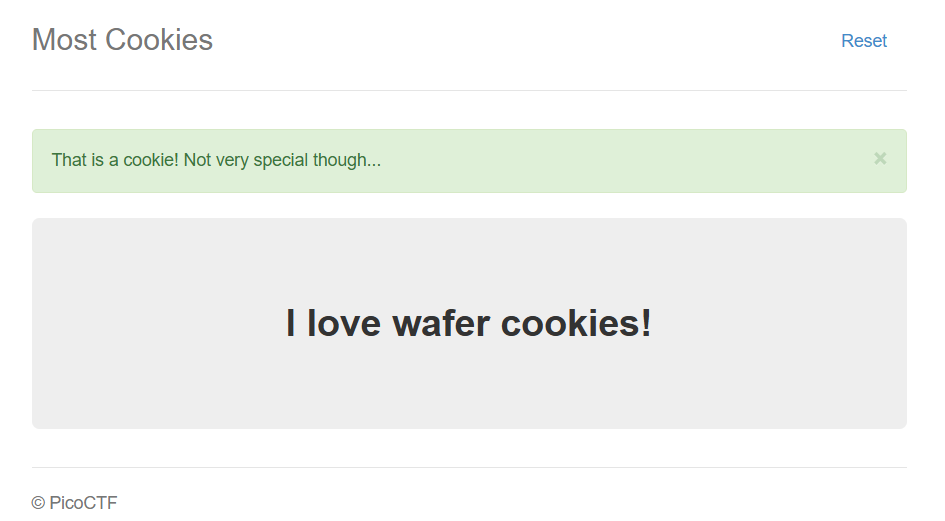  

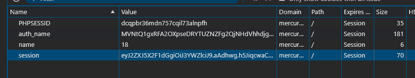  

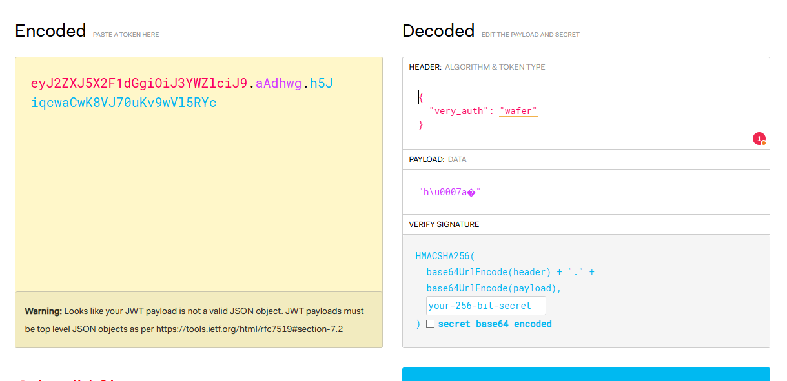  

We will receive a cookie. We can manually change wafer to admin in [jwt.io](https://www.jwt.io), but we do not know the secret key that was used to sign this token. 
However, this key is definitely one of the words in `cookie_names`.  

So we need:  
- create tokens with each of the potential keys from `cookie_names`
- so that cookie will contain json data `{"very_auth":"admin"}`
- to have the correct timestamp (so that cookies are not expired or set for a future date)
- take any cookie from the web application [http://mercury.picoctf.net:18835](http://mercury.picoctf.net:18835), decode it and recalculate the signature to compare it with each signature created with each word from the `cookie_names` array

<details>
  <summary><em> About JWT </em></summary>

JWT has a specific format, `Header.Payload.Signature`, where *Header* and *Payload* are base64url-encoded JSON data.  

The Flask session cookie also contains encoded session data (JSON), but the format and addition of extra data (such as timestamp and salt, visible in the `.aAPAGg` part) are different.  

 When Flask signs a session cookie, it takes the encoded session data (and additional data implemented using the itsdangerous library), 
 and calculates an HMAC (itsdangerous uses HMAC-SHA1 by default) from this data using a secret key (e.g., the word "macaroon") as the key for the HMAC function. 
 The secret key is used precisely as a sequence of bytes that corresponds to the characters in the word "macaroon".  
 
[jwt.io](https://www.jwt.io) is great for JWT, but it doesn't recognize Flask's session cookie format "out of the box."

  
</details>

First, let's try the [Flask-Unsign](https://github.com/Paradoxis/Flask-Unsign) tool for manipulating session cookies in Flask.  

Example from tool's GitHub page:   
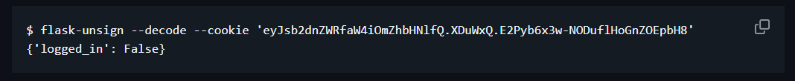  

```shell
flask-unsign --decode --cookie 'eyJ2ZXJ5X2F1dGgiOiJzbmlja2VyZG9vZGxlIn0.aASsiA.UZbs631WPFgGGsVh7UQqzOIXHHk'                                     
{'very_auth': 'snickerdoodle'}
```

```shell
flask-unsign --decode --cookie 'eyJ2ZXJ5X2F1dGgiOiJzbmlja2VyZG9vZGxlIn0.aASsiA.UZbs631WPFgGGsVh7UQqzOIXHHk' --secret 'macaroon'
```

```shell
{'very_auth': 'snickerdoodle'}
```

The signature ‘macaroon’ is not valid.  
Let's set up a wordlist for cookie brute force. Can be downloaded as:  

```
pip install flask-unsign[wordlist]
```

but in our case, we will create our own:  
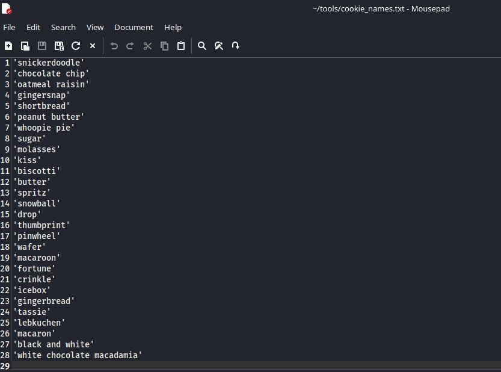  

Next, we need a modified cookie in which the first part (up to the first dot, which is base64-encoded json data) will be `{"very_auth":"admin"}`. We take the cookie from the web application and then encode the payload in base64:  
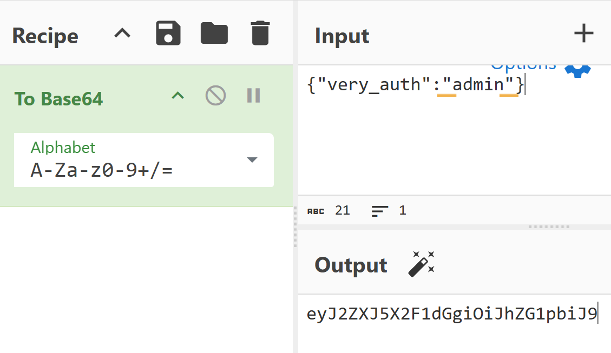  

and replace it. We get `eyJ2ZXJ5X2F1dGgiOiJhZG1pbiJ9.aASsiA.UZbs631WPFgGGsVh7UQqzOIXHHk`  
Let's try brute force:  
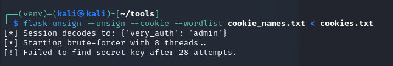  

[Here](https://github.com/HHousen/PicoCTF-2021/blob/master/Web%20Exploitation/Most%20Cookies/script.py) I found a Python program to solve this task.  

> [!TIP]
> I added additional explanations to code and left it all here: [*click*](../content/scripts/web%20exploitation/trickster/Most%20Cookies/solution_script.py)

<details>
  <summary><em>Script breakdown</em></summary>
  
The following occurs in this program:  

There is a function `def flask_cookie(secret_key, cookie_str, operation)`: which configures and uses the main class from itsdangerous: `URLSafeTimedSerializer`. 
In other words, this function implements the algorithm that Flask uses to sign cookies, but in a slightly simplified form.
Components of `URLSafeTimedSerializer`:  
- `secret_key` - known only to the server, used to calculate the cryptographic signature (HMAC). Without this key, it is impossible to create a valid signature for new data or verify the signature of existing data.
- `salt` - in the program, it has the default value 'cookie-session'
- `serializer` – The `TaggedJSONSerializer` object converts a dictionary into a JSON string and adds a special prefix (tag) so that when reading data, `itsdangerous` knows that it needs to be deserialized as JSON.
- `signer_kwargs` – Dictionary with additional parameters for creating a signature (HMAC). In the program, it has the value `{'key_derivation': 'hmac', 'digest_method': hashlib.sha1}`  

What the function does (this is performed by the method `s.dumps(cookie_str)` ):  
- Serializes `{"very_auth": "admin"}` and probably adds the `.json` tag. The output is something like `'.json{"very_auth": "admin"}'`
- `URLSafeTimedSerializer` adds the current time (timestamp) to the data that will be signed. This is done so that the cookie has a limited lifetime.
- Serialized data + timestamp/metadata form a string that will be the basis for the signature. (Payload)
- Using secret_key, salt ('cookie-session') and the method `key_derivation='hmac'` – this is a secret key + salt, processed
- HMAC is calculated using the `digest_method=hashlib.sha1` algorithm.
- The payload and the resulting HMAC are encoded in Base64 and combined `base64(Payload).<addidional data>.base64(HMAC)`

Below the flask_cookie function in the `for possible_secret_key in possible_keys`: 
when we call `cookie_decoded = flask_cookie(possible_secret_key, cookie_str, "decode")` 
we pass the values from the `possible_keys` array (cookie_names in server.py) through the loop, pass `cookie_str` taken from the web application, 
and the operation to be performed (decode/encode). 
The decode operation is performed by the method `s.loads(cookie_str)` in order to verify that:  

- break down `cookie_str` into payload and HMAC
- select Payload and check timestamp/metadata
- if the timestamp is expired, it throws a BadTimeSignature exception, which will be caught by the except block and the following key will be applied
  ```python
  except BadTimeSignature:
   # If the decoding fails then try the next key.
   continue
  ```
- secret key that was passed to URLSafeTimedSerializer (`possible_secret_key`), the same salt ('cookie-session') and method key_derivation, the signing key is generated
- HMAC of this key is recalculated: Signature = HMAC(secret_key, Payload)
- Compared to the decoded signature that was taken from `cookie_str`

</details>

If the keys match, then:  
```python
secret_key = possible_secret_key
# Break the loop when we have the corret key.
break
```

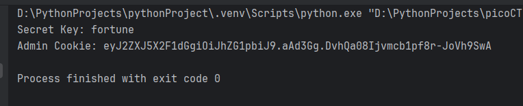  

You can also sign cookies using the aforementioned [Flask-Unsign](https://github.com/Paradoxis/Flask-Unsign)  
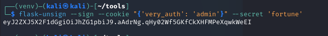  

Insert into the web application:  
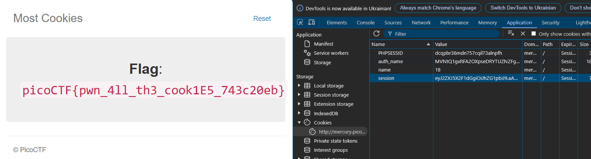  


`picoCTF{pwn_4ll_th3_cook1E5_743c20eb}`


