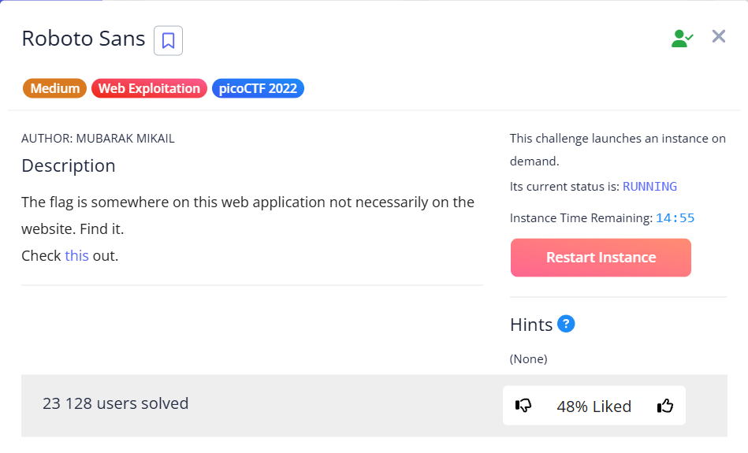
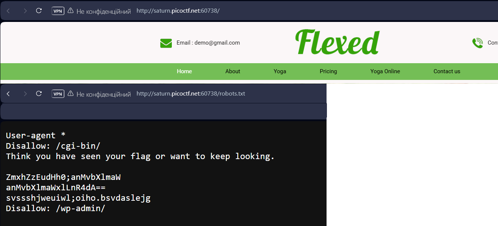
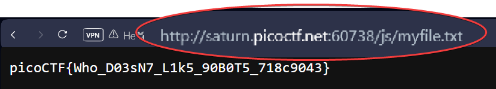

In this task, you need to extract a flag from a web application, and not necessarily directly from the web application itself. <br><br>
First check `robots.txt` file:




Looks like base64. Trying decode this. I use [CyberChef](https://gchq.github.io/CyberChef/): 

```
ZmxhZzEudHh0;anMvbXlmaW --> flag1.txtjs/myfi
anMvbXlmaWxlLnR4dA==    --> js/myfile.txt 
```

Let's try substituting this path into the URL:





`picoCTF{Who_D03sN7_L1k5_90B0T5_718c9043}`

