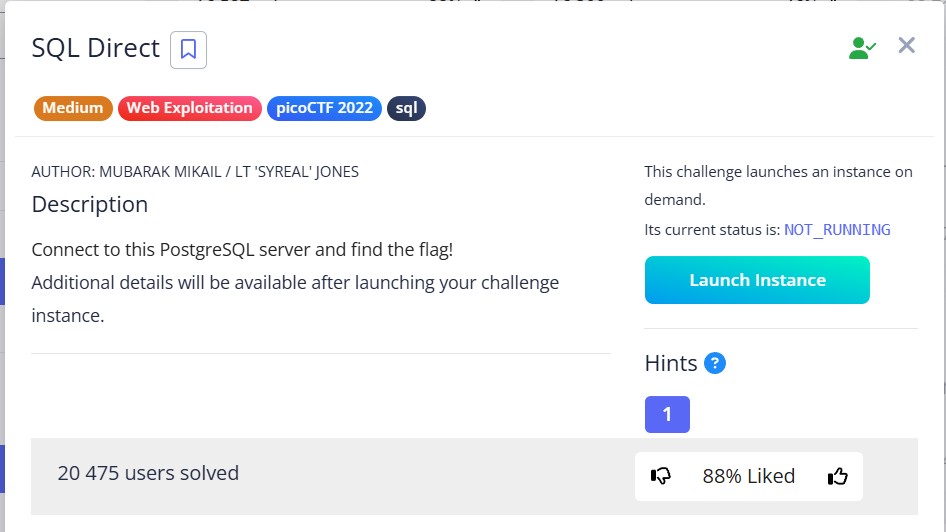
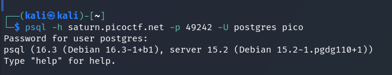
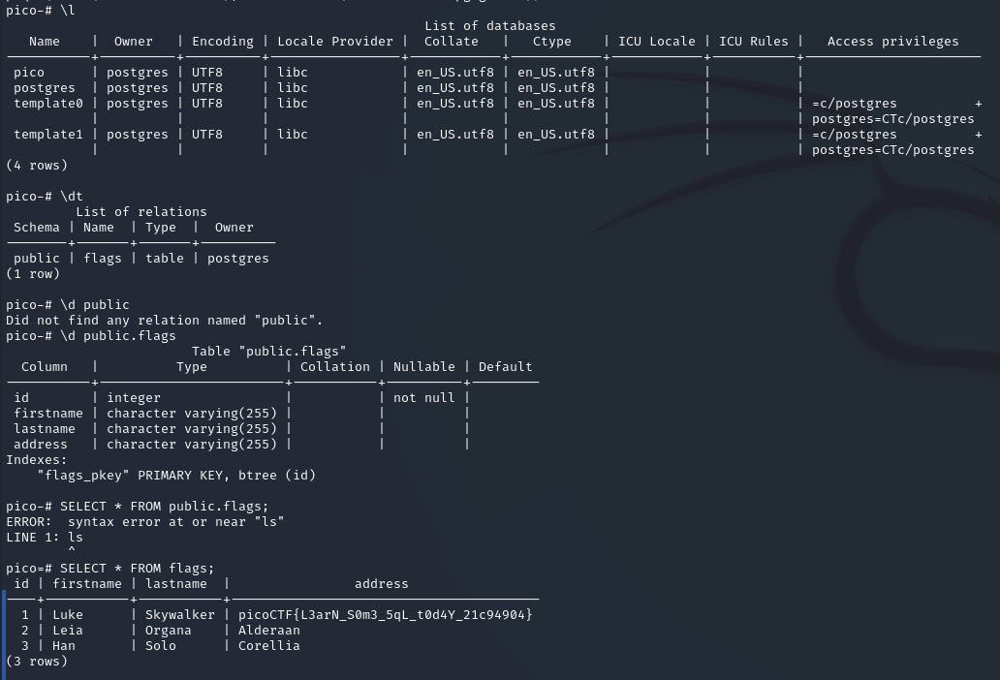

In this task, we need to use psql commands to view a table containing a flag as a record.
This PostgreSQL [Cheat Sheet](https://www.tigerdata.com/learn/postgres-cheat-sheet) helped a lot.
  

First, let's connect:

  

 

* `\l` : List PostgreSQL databases
* `\dt` : List tables from current schema
* `SELECT * FROM public.flags;` : `public` – **schema** name. `flags` – **table** name.

> [!NOTE]
> `public` – This is the default schema that is automatically created when any new database is created.

When we specify `public.flags`, we explicitly tell the database that we want to select data from the `flags` table, which is located in the `public` schema.

`picoCTF{L3arN_S0m3_5qL_t0d4Y_21c94904}`
