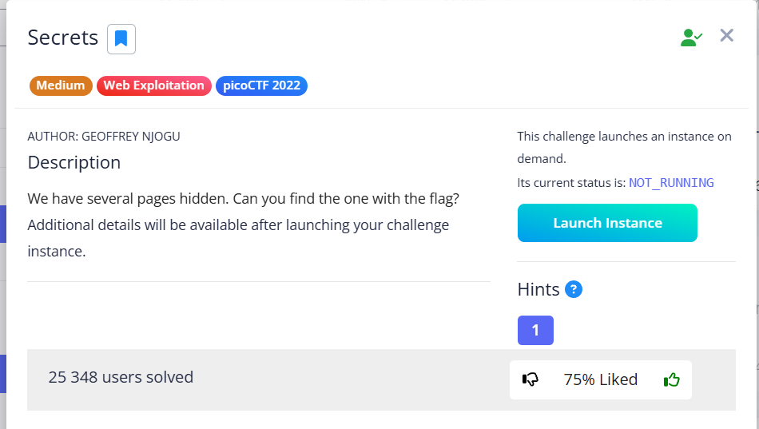

In this task, we need to search for hidden directories on the target host.

### ffuf

Let's start with ffuf. We will scan the directories on the host:

```bash
ffuf -w /usr/share/wordlists/dirb/common.txt -u http://saturn.picoctf.net:54588/FUZZ -e html,php,txt,bak,old,json,xml,log,conf,config
```

* `-u`: url
* `-e`: extensions

Result: 


Found directory named `secret`. But when we try to switch to it, burp (and `ffuf` also indicated code `301`) we get a redirect that leads nowhere (blank page).


> [!NOTE]
> This often indicates that the directory exists, but it **does not contain the <code>index.html</code> file**, or the server is not configured to automatically list directories.
>
> In other words, flag is not located on the `/secret` page itself, but in another file **inside** this directory.

Let's dig deeper: `<picohost>:<port>/secret` :
```bash
ffuf -w /usr/share/wordlists/dirb/common.txt -u http://saturn.picoctf.net:54588/secret/FUZZ -e html,php,txt,bak,old,json,xml,log,conf,config
```


Let's go through all the options we found:

```
/secret/assets
/secret/hidden
/secret/index.html
```

Something interesing found in `/secret/index.html`


### Inspect source code 

Let's inspect the HTML code of the page.


After trying out different URL options, I found `/secret/hidden/index.html`:


Let's examine the code of this page with input forms:


Go through the URL options and arrive at the flag: 


`picoCTF{succ3ss_@h3n1c@10n_51b260fe}`
