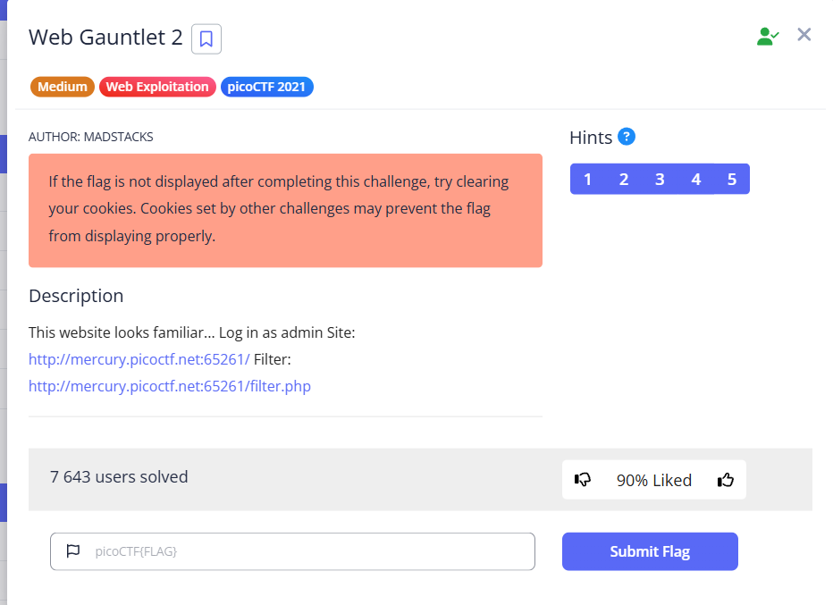
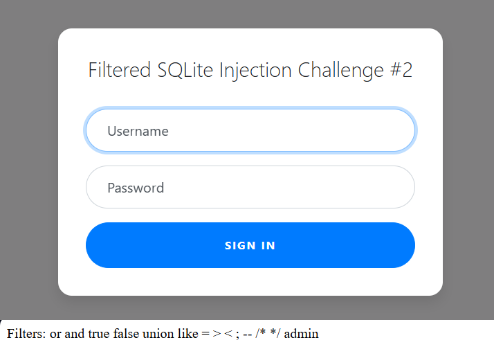
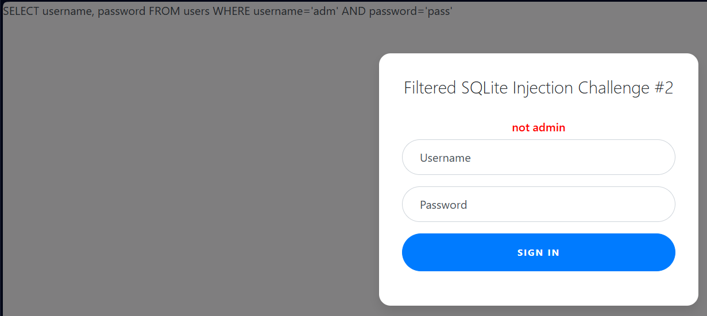
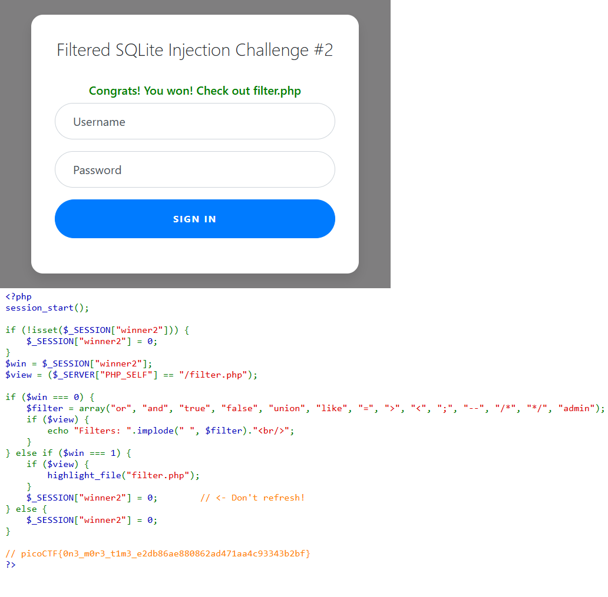

This task has an input form and a list of characters and commands that are filtered. \

Wehave one URL with form: [http://mercury.picoctf.net:65261/](http://mercury.picoctf.net:65261/) 

And second with filter: [http://mercury.picoctf.net:65261/filter.php](http://mercury.picoctf.net:65261/filter.php)





When attempting to enter something in the field, we receive an SQL query that is executed when the form is submitted: \





```sql
SELECT username, password FROM users WHERE username='adm' AND password='pass'
```


This can be bypassed as follows:


```sql
SELECT username, password FROM users WHERE username='ad'||'min' AND password='2' is not '3'
```


`ad'||'min ` : here we separate `ad` and `min` with `'` symbols, so that SQL interprets this as two separate lines that need to be joined together

`2' is not '3` Similarly, we separate the numbers so that they are treated as two separate numbers. If there will be `2 is not 3` , then in the SQL query it will look like a single continuous string `password='2 is not 3'` This condition simply checks whether the value in the password column is equal to the string "2 is not 3".




picoCTF{0n3_m0r3_t1m3_e2db86ae880862ad471aa4c93343b2bf}
