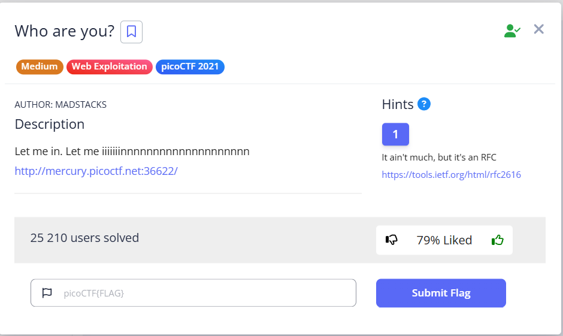
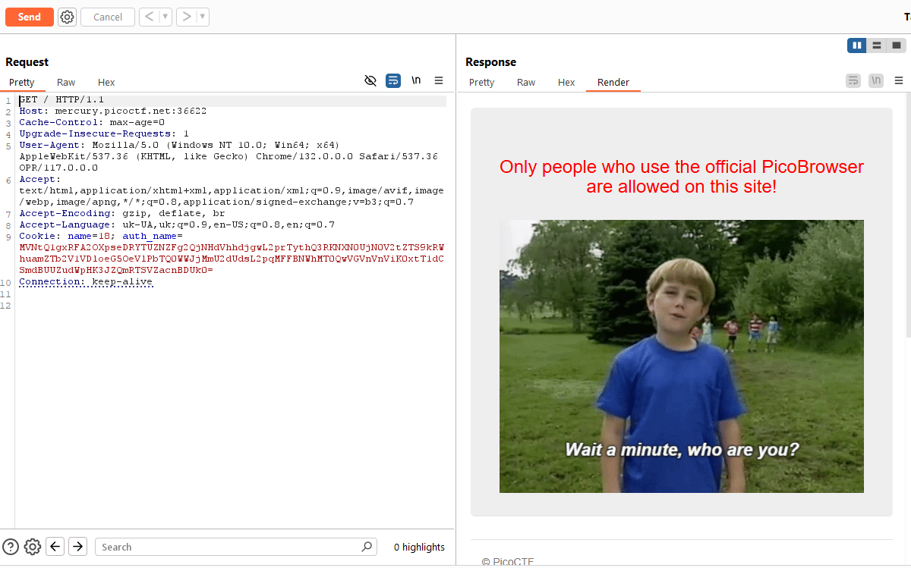
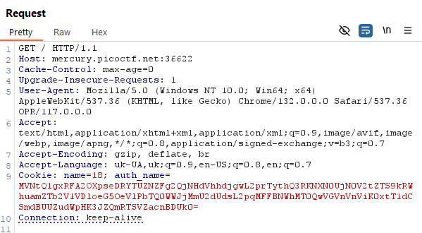
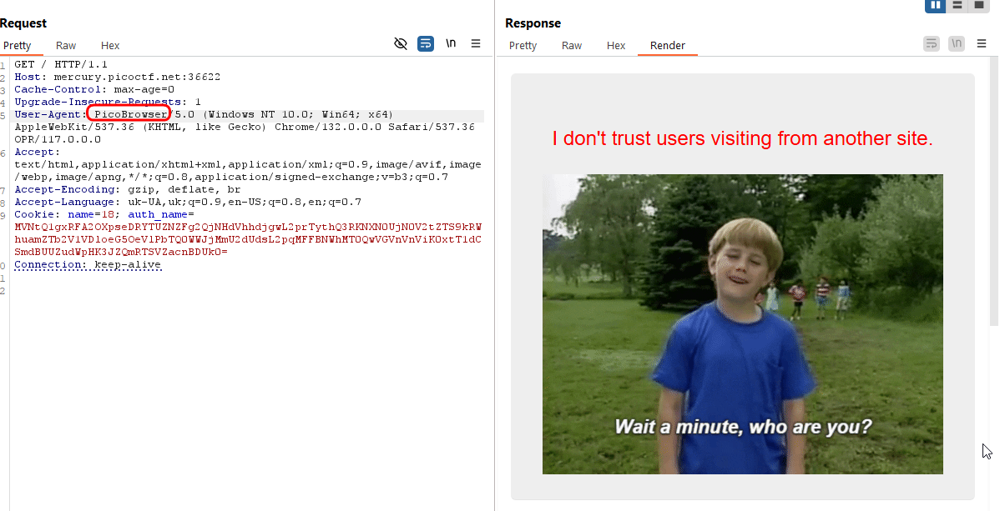
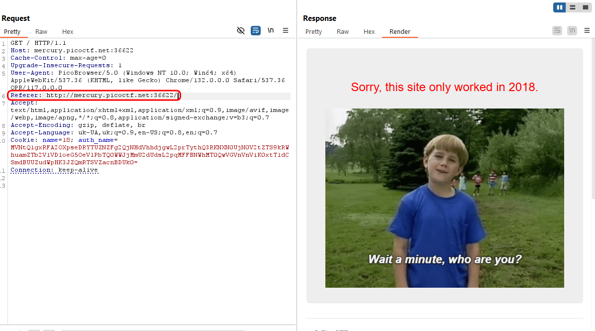
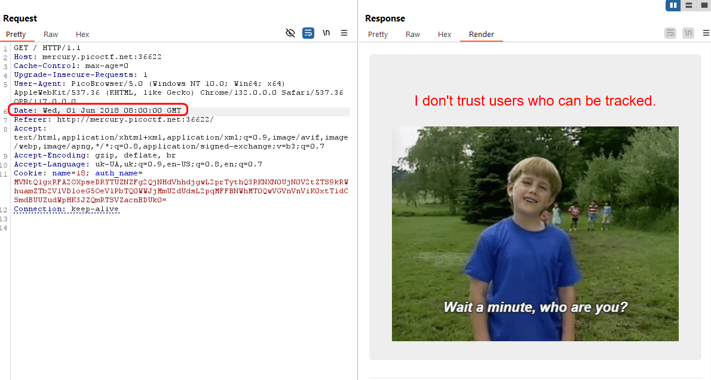
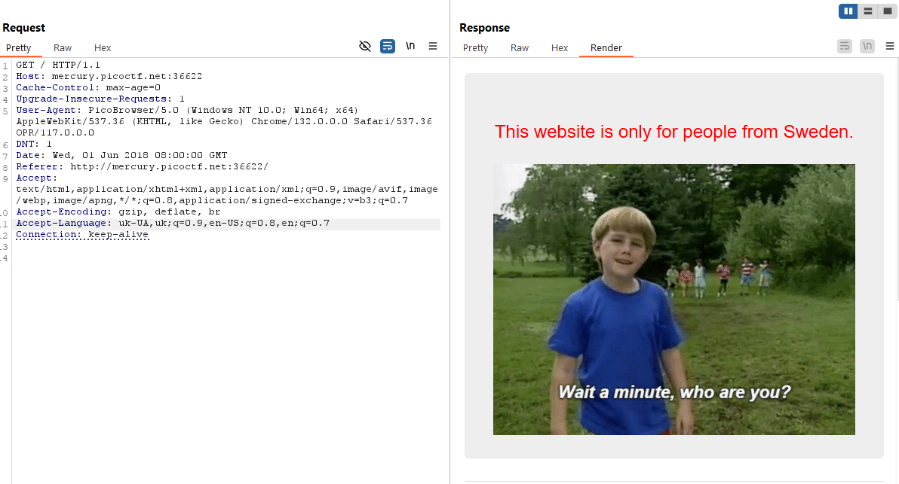
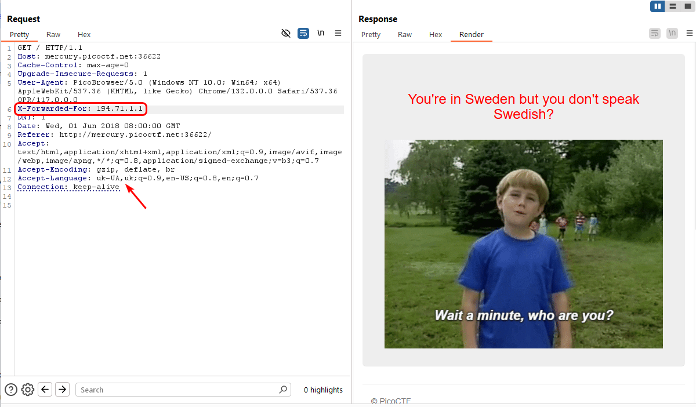
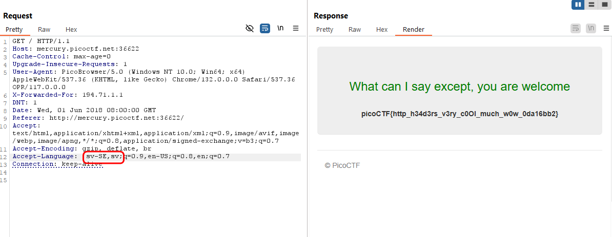

We go to the URL and intercept the request in Burp. 

Initial request: 

First, we modify the User-Agent request and change `Mozilla -> Picobrowser`: 
 

We get the phrase "I don't trust users visiting from another site." This suggests that  the website checks not only the `User-Agent` header, but also the `Referer` header . This means that the site also checks which site the request came from and whether it came from an "official" site. We add:

The phrase "Sorry, this site only worked in 2018" suggests that the site can be "tricked" by adding a `Date` header and specifying the date in the format

Date:  Wed, 01 Jun 2022 08:00:00 GMT ([About `Date` header](https://http.dev/date)) We are adding, but with `2018`:

The phrase "I don't trust users who can be tracked" means that the server detects certain headers or parameters of your request that allow it to be tracked. Let's remove `Cookie` and add `DNT: 1` (do not track):

Now we need to specify that we are from Sweden. Let's add header `X-Forwarded-For: 194.71.1.1` (with Swedish IP):

But don't forget to change language from `uk-UA,uk;` to `sv-SE,sv;`

picoCTF{http_h34d3rs_v3ry_c0Ol_much_w0w_0da16bb2}

