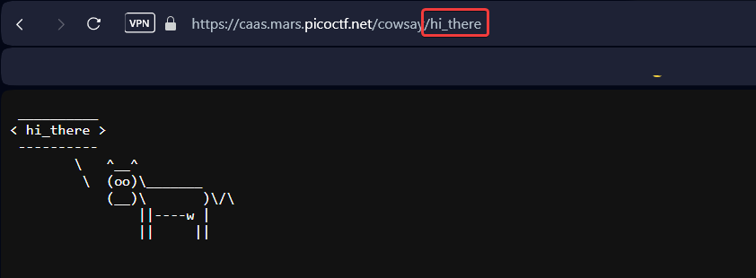

In this task, we have a website that displays any text entered into the URL on the screen: 





This leads us to a Command Injection vulnerability. There is also a file with a backend on `js`. 


```javascript
exec(`/usr/games/cowsay ${req.params.message}`
```

The main vulnerability is in the line provided above. It means that the server will use the `exec` function to execute the command `/usr/games/cowsay` with the user's text as an argument.


> [!NOTE]
> **Reason of vulnerability:** The value of the variable `${req.params.message}` (which is controlled by the attacker via the URL) **is directly inserted into the command string**, which is passed to the operating system shell for execution (`exec` uses the shell). The shell interprets metacharacters `` ;  |  &  &&  ||  $  `  >  <  "  ' ``, which allows an attacker to "break out" of the initial command `/usr/games/cowsay` and execute their own arbitrary commands.
> 
> How to detect this vulnerability:
>
>
> * You need to look for places where functions for executing external commands are used with a command string that is constructed by **concatenating with unverified or unescaped user input**:
>   * `child_process.exec`, `child_process.spawn` in Node.js
>   * `os.system`, `subprocess.run` з `shell=True` in Python
>   * `Runtime.exec` in Java
> * Availability `$ {req.params.message}` (or a similar variable containing user input) directly in the command line passed to `exec` is a strong indicator of Command Injection vulnerability.


Let's try to input not just text, but for example: `hello; ls`. Here, the text will be separated by a `;` from the shell command. Then the command string that the server will execute will be:

```
/usr/games/cowsay hello; ls /
```


The shell interprets `;` as a command separator. First it will execute (`/usr/games/cowsay hello`), then second (`ls /`), that will print list of files in `/` directory on the server. The output of both commands (cowsay and ls) will be sent to `stdout`, which the server sends to the client in response.

Input: 
```
hello; ls; cat falg.txt
```


`picoCTF{moooooooooooooooooooooooooooooooooooooooooooooooooooooooooooo0o}`
