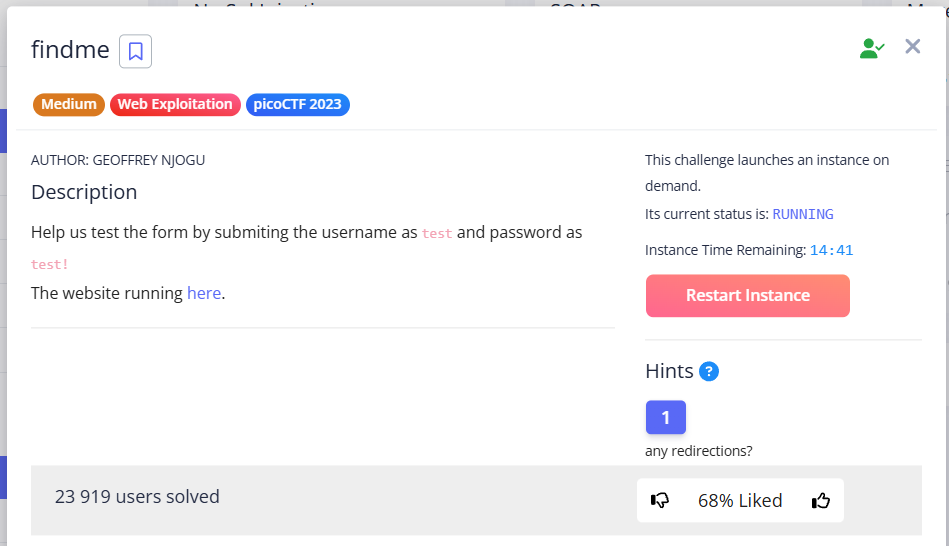
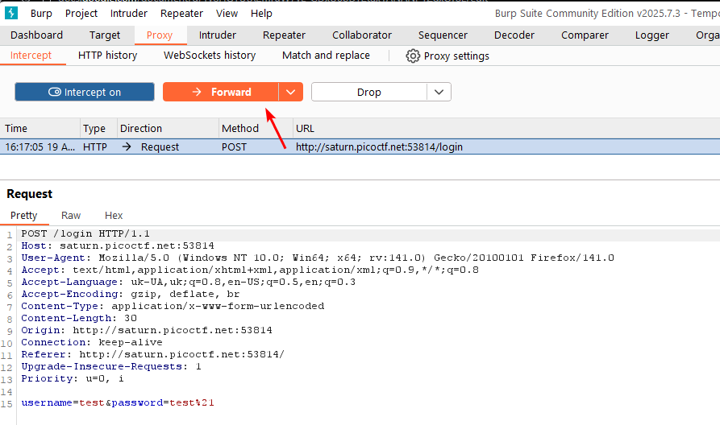
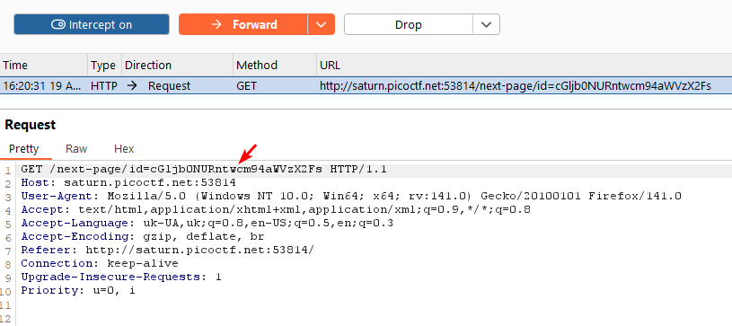
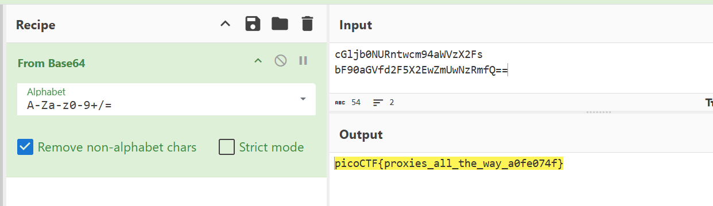

This task involves following redirects.

---

Let's log in with creds `test:test!` and intercept this POST request:





Press `Forward` and see text in the URL that looks suspiciously like base64:  





Continue pressing `Forward` and get next part:


```
cGljb0NURntwcm94aWVzX2Fs
bF90aGVfd2F5X2EwZmUwNzRmfQ==
```





`picoCTF{proxies_all_the_way_a0fe074f}`
