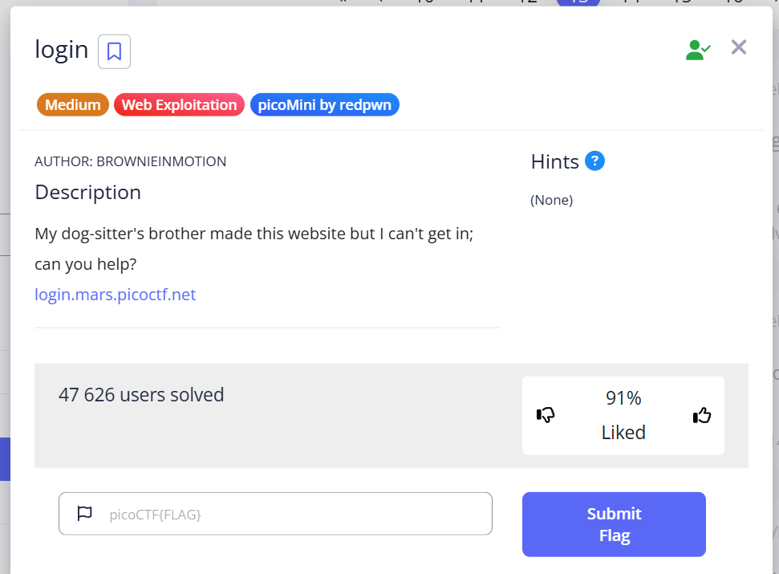
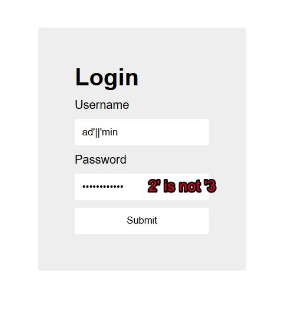
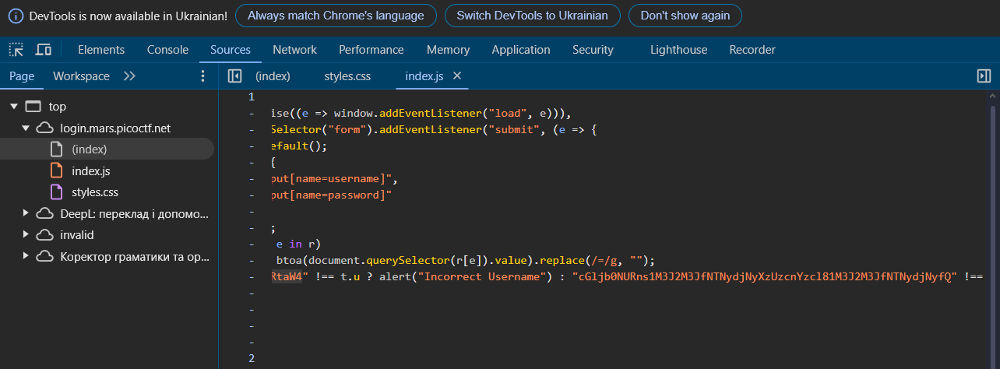
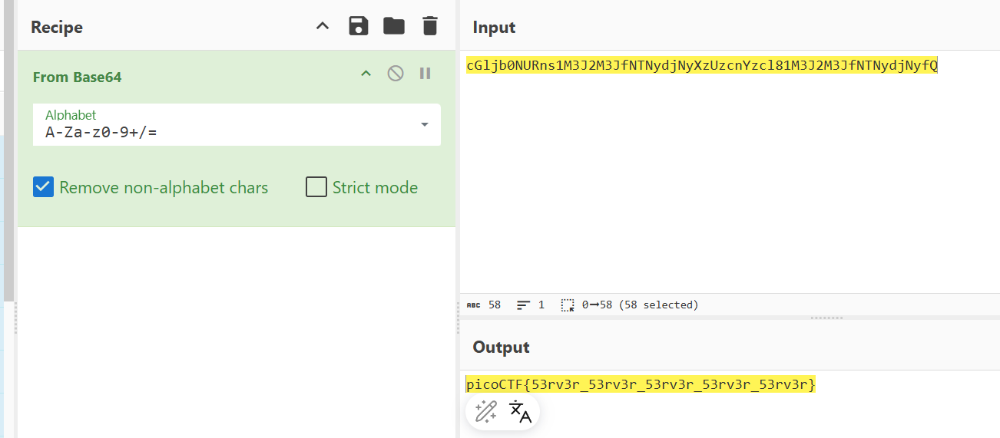

This task includes a website with an input form on the website: [https://login.mars.picoctf.net/](https://login.mars.picoctf.net/) 

Let's try a standard SQL injection trick.

Check source code:

There is a string similar to a base64 here, let's try to decode it:

picoCTF{53rv3r_53rv3r_53rv3r_53rv3r_53rv3r}
