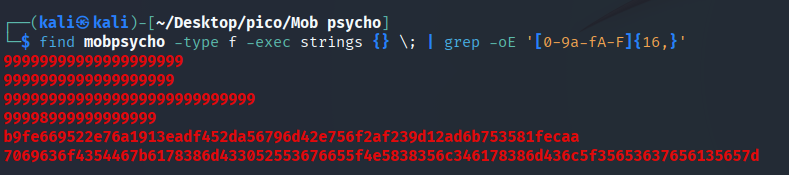
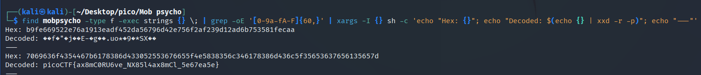

Скачуємо файл `mobpsycho.apk`, командою `file` розпізнається як `Zip archive data`.

## Розпакування

Розпакувати цей apk можна 3 способами:


```bash
apktool d mobpsycho.apk
unzip mobpsycho.apk -d mobpsycho
binwalk -e mobpsycho.apk
```


## 
Пошук за `'picoCTF\{.*\}'` 


Щоразу була створена окрема директорія, тож я почав шукати збіг “`picoCTF{`” по кожній з таких директорій цілком:

Пошук strings з grep по всіх файлах рекурсивно:


```bash
find mobpsycho -type f -exec strings {} \; | grep -oE 'picoCTF\{.*\}'
```


Скорочений варіант з xargs:


```bash
find mobpsycho -type f -print0 | xargs -0 strings | grep -oE 'picoCTF\{.*\}'
```


Спробував пошук вручну по файлах:

```bash
strings mobpsycho/AndroidManifest.xml | grep -oE 'picoCTF\{.*\}'
strings mobpsycho/classes.dex | grep -oE 'picoCTF\{.*\}'
strings mobpsycho/classes2.dex | grep -oE 'picoCTF\{.*\}'
strings mobpsycho/classes3.dex | grep -oE 'picoCTF\{.*\}'
```

Пошук в res директорії:

```bash
find mobpsycho/res -type f -exec strings {} \; | grep -oE 'picoCTF\{.*\}'
```

Пошук як в текстових, так і в бінарних файлах:

```bash
grep -r -a -oE 'picoCTF\{.*\}' mobpsycho/
```
## Пошук за `'[0-9a-fA-F]{16,}'` 

Потім мені прийшла думка, що можливо прапор якось закодований, наприклад у hex-коді. Тож я склав регулярний вираз, який міститиме:

* числа 0-9
* літери англ. алфавіту нижнього і верхнього регістрів
* мінімальна довжина послідовності від 16 символів

Спробуємо базовий пошук за вищенаведеними правилами:

```bash
find mobpsycho -type f -exec strings {} \; | grep -oE '[0-9a-fA-F]{16,}'
```





Одна з послідовностей виглядає достатньо довгою, щоб бути прапором, але спробуємо ще варіанти пошуку.

Додамо `sort -u`:


```
find mobpsycho -type f -exec strings {} \; | grep -oE '[0-9a-fA-F]{16,}' | sort -u 
```


Оскільки потенційний прапор ми знайшли, спробуємо сформувати команду, яка виводить тільки його, максимально не засмічуючи термінал. Для цього візьмемо перші символи hex-коду прапора:


```
find mobpsycho -type f -exec strings {} \; | grep -i "7069636f4354467b" | head -5
```


Тепер команда, що шукатиме і розкодовуватиме прапор:


```bash
find mobpsycho -type f -exec strings {} \; |
grep -oE '[0-9a-fA-F]{60,}' | 
xargs -I {} sh -c 'echo "Hex: {}"; echo "Decoded: $(echo {} | xxd -r -p)"; echo "---"'
```




picoCTF{ax8mC0RU6ve_NX85l4ax8mCl_5e67ea5e}

Повний перелік команд для вирішення на моєму GitHub: *[click](https://github.com/Sarmatae685/PicoCTF-write-ups/blob/main/scripts/forensics/Mob%20psycho/bash_to_solve.md)*
